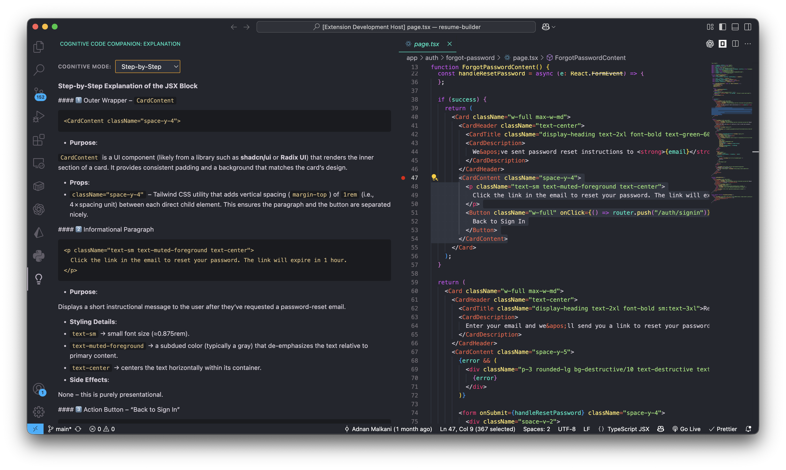
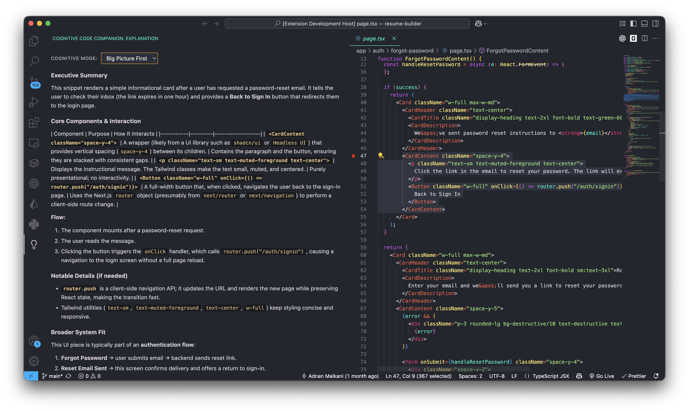
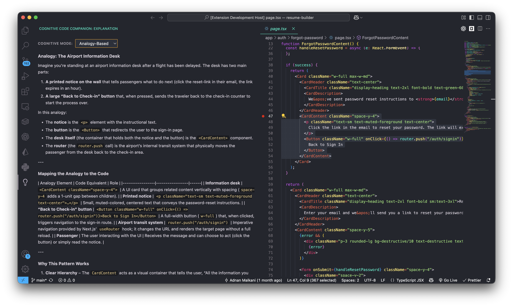
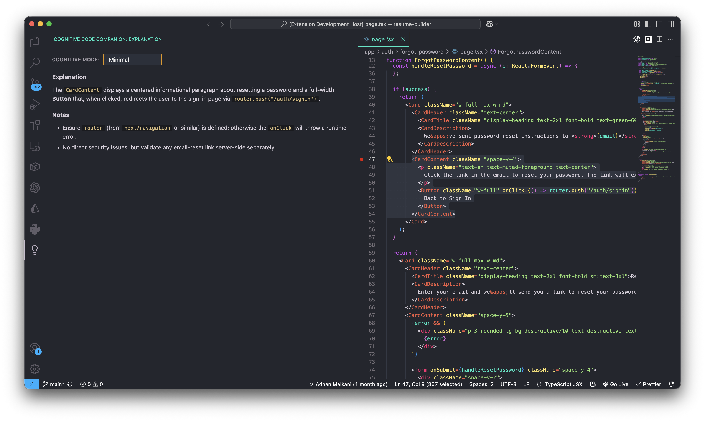

  
  <h1>Cognitive Code Companion</h1>
  
<em>AI-powered code explanations adapted to your unique cognitive style.</em>

  
  

---

## 🧠 What is Cognitive Code Companion?

**Cognitive Code Companion** is an advanced Visual Studio Code extension that reimagines how developers interact with and learn from code. Instead of generic, one-size-fits-all AI explanations, it leverages top-tier Large Language Models (LLMs) to explain your code precisely the way *you* think.

Whether you're a procedural thinker who needs line-by-line breakdowns, a top-down thinker who needs the big picture first, or a visual thinker who learns through analogies, this extension adapts to you.

## ✨ Features

- **Personalized Explainers:** Choose from four distinct cognitive frameworks.
- **Top-Tier LLM Access:** Powered by the OpenRouter API, granting access to cutting-edge models like GPT-5.2, Claude 4.6 Sonnet, Llama 4, Gemini 3.1 Pro, and more.
- **Embedded IDE Experience:** Seamlessly highlight any code snippet, right-click, and select "Explain This Code."
- **Multi-lingual Support:** Need explanations in Spanish, Dutch, or Japanese? Simply configure your preferred language in the settings.
- **Markdown Rich Responses:** Explanations are highly structured, deeply analytical, and beautifully formatted in markdown.

---

## 🎨 Cognitive Styles

1. **Step-by-Step** 👣  
   *Line-by-line procedural walkthroughs.* Perfect for sequentially minded developers who want to understand flow control and exact mechanizations.  
   

2. **Big Picture First** 🔭  
   *Starts with a high-level executive summary, then zooms in.* Best for systems thinkers who need to understand the architecture and "why" before diving into the "how."  
   

3. **Analogy-Based** 🌠  
   *Explains complex concepts using vivid real-world metaphors.* Excellent for conceptual and visual learners who benefit from translating code into familiar mental models.  
   

4. **Minimal** ⚡  
   *Terse, hyper-condensed facts.* Built for senior engineers who just want the critical facts, immediate edge cases, and performance implications with absolutely no fluff.  
   

---

## 🚀 Installation & Setup

1. **Install the Extension**
   - Download the extension from the VS Code Marketplace (Coming Soon!) or install via the generated VSIX file.

2. **Get an OpenRouter API Key**
   - This extension uses OpenRouter to give you access to virtually any LLM.
   - Go to [OpenRouter.ai](https://openrouter.ai/) to create an account and generate an API key.

3. **Configure Settings**
   - Open your VS Code Settings (`Cmd` + `,` or `Ctrl` + `,`).
   - Search for **Cognitive Code Companion**.
   - Input your **API Key**.
   - Select your preferred **Model** (e.g., `nvidia/nemotron-3-super-120b-a12b:free`).
   - Choose your **Explanation Style**.
   - Set your preferred **Language**.

---

## 💻 Usage

1. Open any file in VS Code.
2. Highlight a confusing or complex block of code.
3. Right-click to open the context menu and select **"Explain This Code"** (or use the Command Palette via `Cmd + Shift + P`).
4. A customized, expert analysis of your code will appear in the dedicated Explanation tab!

---

## 🤝 Contributing

Contributions, issues, and feature requests are welcome!
Feel free to check out the [issues page](https://github.com/adnanmalkani/cognitive-code-companion/issues).

## 📄 License

This project is [MIT](LICENSE) licensed.
